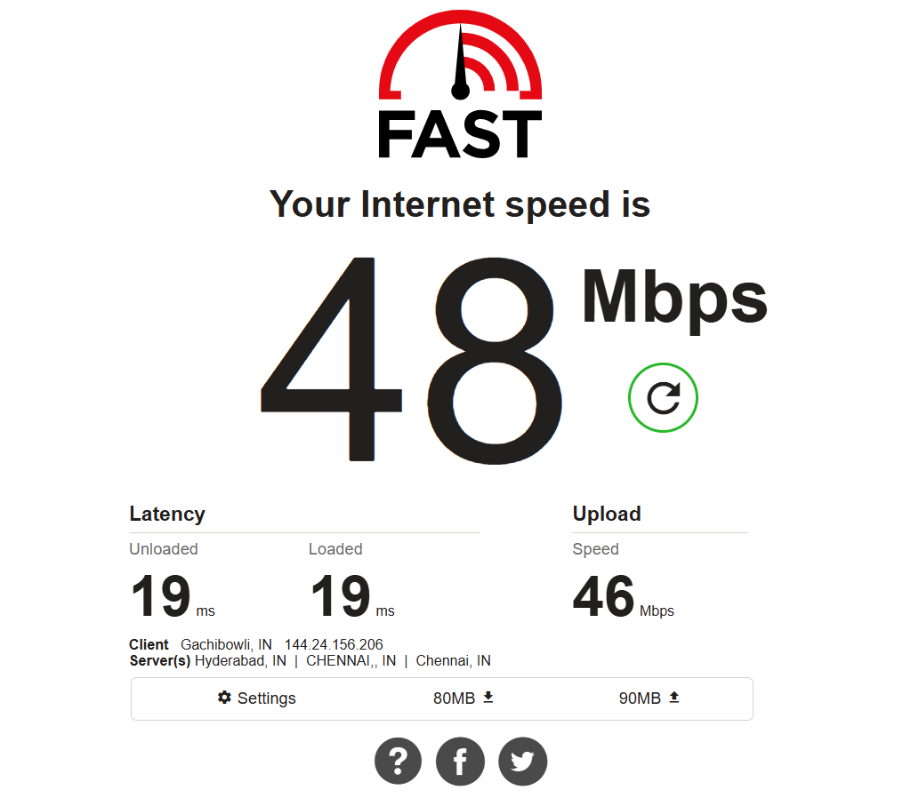

# TLS-MIMICKING-TROJAN-PROXY
# Self-Hosted Trojan TLS VPN (Port 443 Obfuscation)

A research-oriented implementation of a self-hosted VPN using **Trojan over TLS (port 443)** to bypass restrictive campus firewalls by mimicking normal HTTPS traffic.

This project demonstrates how encrypted proxy traffic can be indistinguishable from legitimate web browsing using real certificates and standard web ports.

---

## 🚀 Features

* Trojan protocol over **TLS + port 443**
* Real **Let’s Encrypt SSL certificate**
* Domain-based access via DuckDNS
* Hosted on **Oracle Cloud Free Tier VPS (India region)**
* Client routing using **v2rayN (Windows)**
* Compatible with restrictive networks that block common VPN protocols
* Oracle Cloud Free Tier VPS (Hyderabad, India region)
* Configured cloud ingress rules + Ubuntu firewall routing


---
## 📊 Performance Proof




## 🧱 Architecture


```
Laptop (v2rayN client)
        ↓ encrypted TLS traffic
Campus Network Firewall
        ↓ allowed HTTPS (443)
Oracle VPS (Trojan server)
        ↓ decrypted + forwarded
Public Internet
```

The firewall sees only standard HTTPS traffic, allowing the connection while the VPS securely forwards all requests.

---

## ⚙️ Server Setup (Ubuntu VPS)

### Install dependencies

* nginx
* certbot
* trojan

### Obtain SSL certificate

```
sudo certbot --nginx -d your-domain.duckdns.org
```

### Configure Trojan

Edit:

```
/etc/trojan/config.json
```

Set:

* password
* certificate paths
* listening port (443)

Example config available in:

```
server/trojan-config.json
```

### Start service

```
sudo systemctl restart trojan
sudo systemctl status trojan
```

Verify:

```
sudo ss -tulpn | grep 443
```

---

## 🖥 Client Setup (Windows)

1. Install **v2rayN**
2. Add new Trojan profile:

| Field    | Value                   |
| -------- | ----------------------- |
| Address  | your-domain.duckdns.org |
| Port     | 443                     |
| Password | same as server          |
| TLS      | enabled                 |
| SNI      | your-domain.duckdns.org |

3. Enable:

* Set System Proxy → ON
* Routing → Global

---

## 🔍 Verification

Check VPS IP:

```
curl https://ipinfo.io
```

Check client IP:

```
curl https://ifconfig.me
```

Client IP should match VPS IP.

---

## ⚠️ Notes

* Some UDP-heavy applications (e.g., online games) may not work reliably because Trojan TLS primarily tunnels TCP traffic.
* Real domain + certificate required for best firewall evasion.
* Do NOT upload private keys or real passwords to this repository.

---

## 📚 Learning Outcomes

This project explores:

* TLS certificate chains and HTTPS trust model
* Reverse proxy networking with nginx
* Linux service management (systemd)
* Cloud firewall ingress rules
* SOCKS proxy routing vs system proxy
* Practical censorship-resistant networking

---

## 📄 License

MIT License


